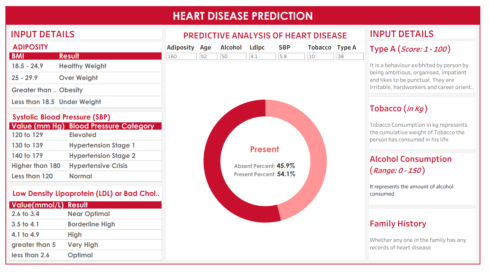

# Heart Disease Prediction Dashboard
### Predictive Analytics with Machine Learning in Tableau

---

## Overview

This project presents an interactive healthcare analytics dashboard designed to predict the probability of coronary heart disease (CHD) using clinical indicators.

The dashboard integrates a machine learning classification model with Tableau visualizations, allowing users to simulate patient profiles and observe how health indicators such as age, cholesterol levels, blood pressure, and lifestyle behaviors influence predicted heart disease risk.

By combining predictive modeling with interactive visualization, the project demonstrates how data-driven tools can support early risk assessment and preventative healthcare analysis.

---

## Business Problem

Heart disease remains one of the leading causes of mortality worldwide. Early detection and preventative interventions can significantly reduce long-term health risks.

Healthcare datasets often contain valuable indicators that can be used to estimate patient risk levels. This project simulates how predictive analytics can be embedded within an interactive dashboard to support risk assessment and clinical decision support.

---

## Dataset

The dataset contains clinical and lifestyle indicators related to cardiovascular health. These features are commonly used in medical risk modeling and epidemiological studies.

The dataset includes attributes such as:

- Age
- Blood pressure
- Cholesterol levels
- Tobacco usage
- Obesity indicators
- Behavioral attributes

The target variable represents whether a patient developed coronary heart disease.

---

## Project Workflow

### 1. Data Understanding

- Imported cardiovascular dataset
- Examined feature distributions
- Identified relevant clinical predictors
- Analyzed relationships between features and the target variable

---

### 2. Model Development

- Constructed a feature matrix using clinical attributes
- Trained a classification model using **scikit-learn**
- Generated both binary classification predictions and probability scores
- Prepared model outputs for dashboard integration

---

### 3. Interactive Simulation

- Built parameter controls for health indicators
- Enabled dynamic user inputs
- Generated predicted CHD probability based on simulated patient profiles

This allows users to explore how different health factors influence predicted risk levels.

---

### 4. Dashboard Design

- Designed a structured visual layout for clinical interpretation
- Added visual indicators for predicted risk levels
- Built an interactive simulation-driven analytical interface

---

## Key Insights

Exploratory analysis of the dataset highlights how multiple health indicators influence heart disease risk:

- Elevated LDL cholesterol and systolic blood pressure are associated with increased CHD probability.
- Tobacco usage and age significantly influence predicted risk levels.
- Risk probabilities change dynamically when clinical indicators are modified through the simulation interface.

This demonstrates how predictive analytics can complement traditional dashboards by enabling scenario-based health risk exploration.

---

## Technical Stack

- Tableau
- Python
- scikit-learn
- Pandas
- NumPy

---

## Skills Demonstrated

- Predictive analytics
- Machine learning model integration
- Healthcare data analysis
- Interactive dashboard design
- Parameter-driven simulation modeling

---

## Author

**Kavya Balaji Singh**
